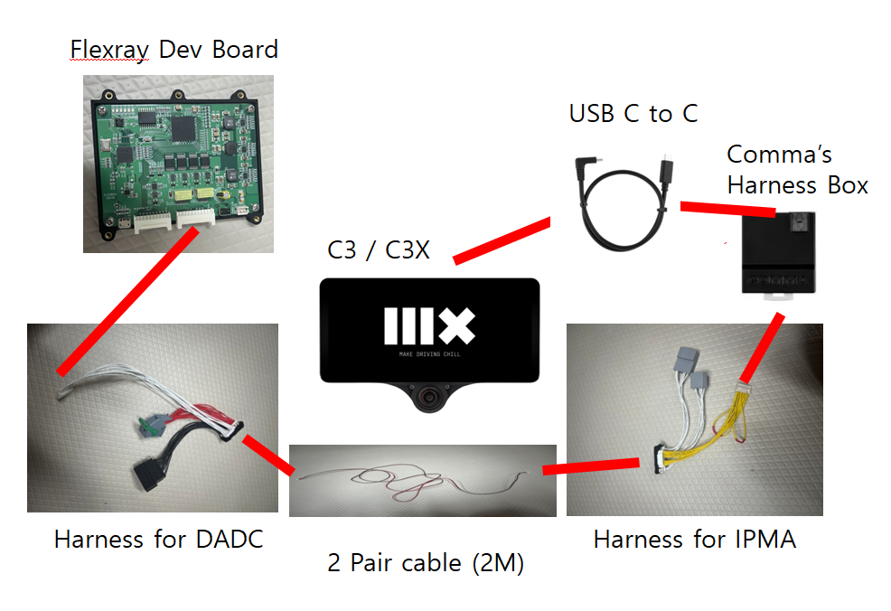
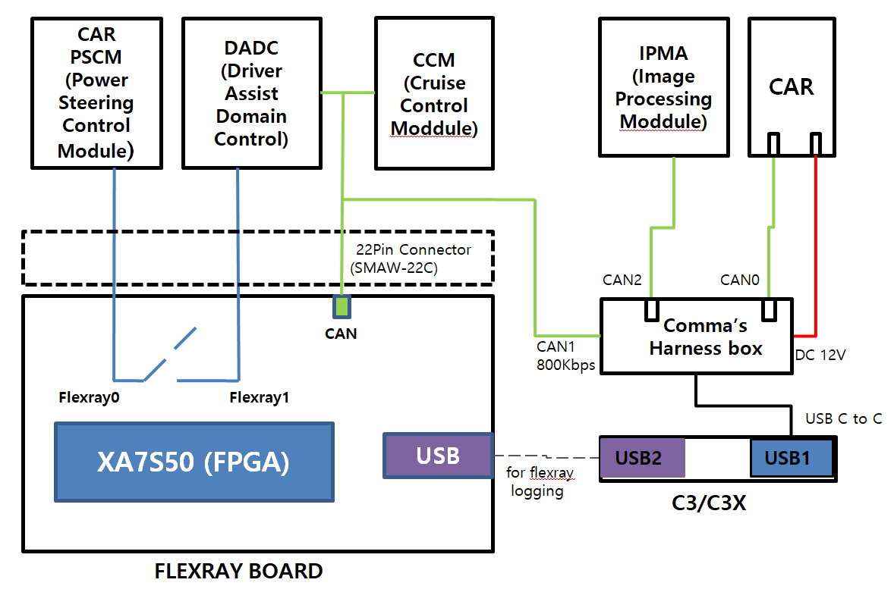
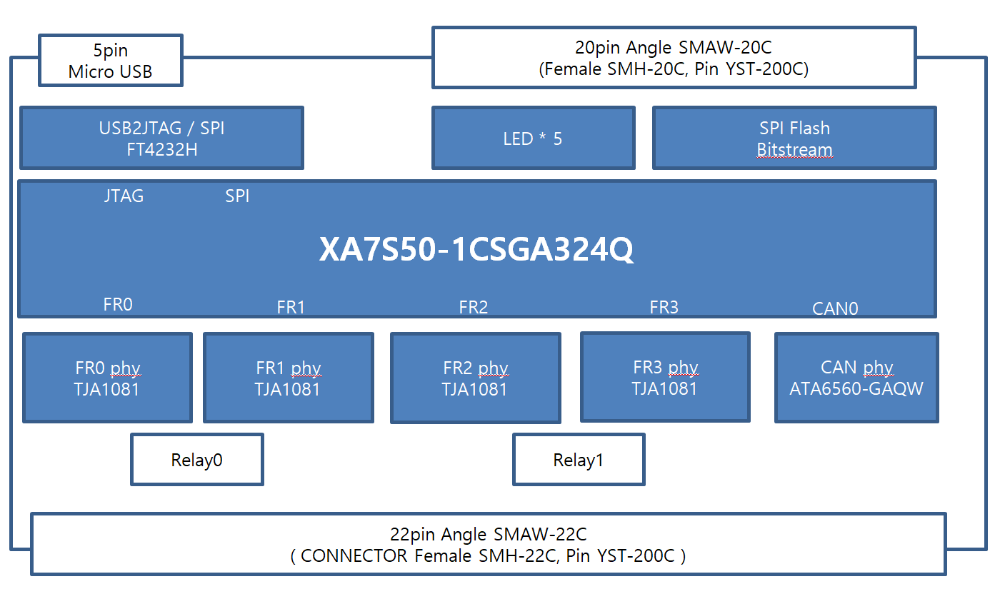
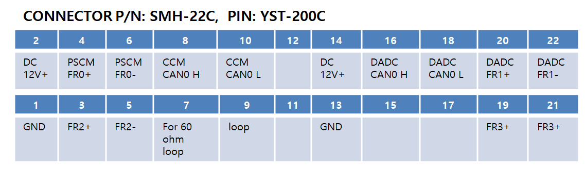
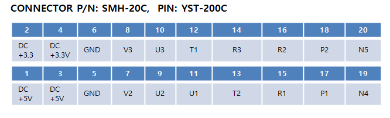
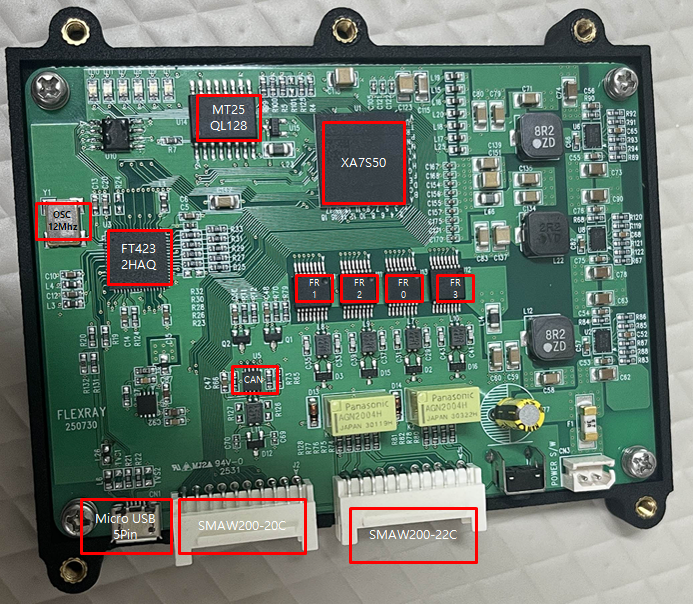
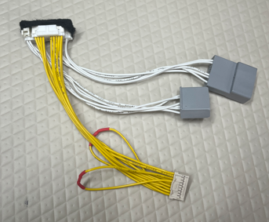
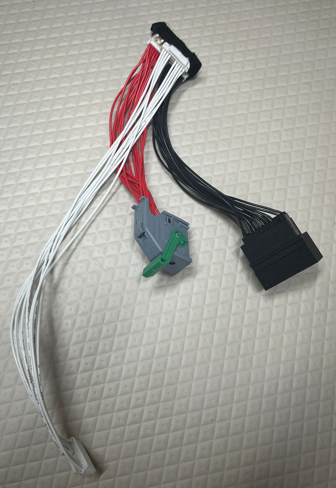

# Installation Guide of C3/C3X, openpilot for LAND ROVER DEFENDER

## 📌 Limitation
- Support only Lateral Control.
- Since lateral control is currently performed using the LKAS command, steering does not work below 50 km.
- Only tested on the 2023 Land Rover Defender 130.

## 📌 Requirements
- [comma 3 or comma 3x](https://comma.ai)
- [Flexray Dev Board for processing Flexray data](#-flexray-dev-board),  [(Reference Willem Melching's Blog)](https://icanhack.nl/blog/audi-flexray/)
- [Y cable harness for IPMA (Image Processing Module)](#-y-cable-harness-for-ipmaimage-processing-module)
- [Y cable harness for DADC (Driver Assistance Domain Controller)](#-y-cable-harness-for-dadcdriver-assistance-domain-controller) 

## 📌 Harness diagram

  
   - There is no need to connect comma power to comma's harness box.  
   - [IPMA Removal a Installation](https://www.lrdefender.org/image_processing_module_a-753.html)
   - [DADC Removal a Installation](https://www.lrdefender.org/driver_assistance_systems-690.html)
     - No need to remove the battery.
     - Disconnect the footwell lamp.
     - Remove the footwell trim panel.
     - No need to Remove the accelerator pedal assembly

## 📌 C3/C3X Block diagram

## 📌 Flexray Dev Board Block diagram for processing Flexray data

### 📌 Flexray Dev Board Connector PIN MAP(Main: 22 Pin, GPIO: 20 Pin)
 

## 📌 Flexray Dev Board
 

---

## 📌 Y cable harness for IPMA(Image Processing Module)

- [MX34020SF1](https://www.digikey.kr/ko/products/detail/jae-electronics/-MX34020SF1/2139261)  20 pin female connector 
- [MX34020PF1](https://www.digikey.kr/ko/products/detail/jae-electronics/MX34020PF1/18996306?s=N4IgTCBcDaILIA0DMAWADGNAHAZiAugL5A) 20 pin male connector
- [Comma's Harness Box](https://comma.ai/shop/harness-box)

- MX34020xF1 20 pin map
  | num |  color      | desc                    |
  |-----|-------------|-------------------------|
  |  1  |  WH         | ETH High(broadR-Reach)  |
  |  2  |  GN         | ETH Low (BroadR-Reach)  |
  |  7  |  BU         | E-CAN High              |
  |  8  |  BU-GN      | E-CAN Low               |
  | 10  |  BU-BN      | +12V                    |
  | 17  |  BK         | Ground                  |

## 📌 Y cable harness for DADC(Driver Assistance Domain Controller)

 

- [284714-1](https://ko.aliexpress.com/item/1005004319496605.html?spm=a2g0o.order_list.order_list_main.5.1637140f944ZOH&gatewayAdapt=glo2kor) 24 pin female connector

  

- male connector  for 284714-1 24 pin female connecotr
  
  I don't know part number.

 

 
  It's on here [alibaba](<https://www.alibaba.com/product-detail/High-Precision-Small-Connector-Shell-IATF16949_1601044183554.html?spm=a2700.picsearch.normal_offer.d_image.48ba5f93RwfHtd>), but it's not for sale.
  
   So I bought a used ECU with a similar connector.
   I modified it and used it.

 - [Citroen C4 Picasso SRS Safety Restraint Control Module Unit 9664217980](https://www.ebay.com/itm/364957102520?_skw=9664217980&itmmeta=01JRFEWB2DCGSR8CWJN24EH1V5&hash=item54f92371b8:g:viYAAOSwLRpmcYx7&itmprp=enc%3AAQAKAAAA4FkggFvd1GGDu0w3yXCmi1dc33oIzpRxTV276AApSO2FcOpgTkn3XBLVV9q95MWhQjp8IWd8BfkSUS9Chbgz4%2BR3y174vvWaSzwLWRCZJqfkN%2B9c1484jR%2FCdm2fG4L8y%2B8jvW9RVZN5KxmexLKq5Vn9rNnBPa6Mjzr02mfCxJrngQ3ODWwPquKT3s6FcQkEVDDUr0K4WpYJwIBbl8Ql5YnY63zkXPp%2FOZGUN1%2BM4qxgT%2BYu%2BHXnccCqBSh2yiicXhJ08%2FQMRW8DIKICKP9TD98jEKIbcXQxcxtCXdWkm7kq%7Ctkp%3ABk9SR6qx8e7DZQ)

 - DADC 24 pin connector 284714-1 pin map

  | num |   desc                                       |
  |-----|----------------------------------------------|
  |  1  |  Bat+                                        |
  |  3  |  CAN2 H (Under BODY CAN, same IPMA CAN H)    |
  |  4  |  CAN2 L (Under BODY CAN, same IPMA CAN L)    |
  |  7  |  Flexray1_BP (to SWM, Steering Wheel Module) |
  |  8  |  Flexray1_BM (to SWM)                        |
  |  9  |  BAT GND                                     |
  | 11  |  BR1_P (to BCM, BroadR-Reach)                |
  | 12  |  BR1_M (to BCM, BroadR-Reach)                |    
  | 13  |  IGN                                         |
  | 15  |  CAN3 H (CCM, Cruise Control Module Radar)   |    
  | 16  |  CAN3 L (CCM, Cruise Control Module Radar)   |
  | 19  |  Flexray1_BP (to BCM)                        |   
  | 20  |  Flexray1_BM (to BCM)                        |
  | 21  |  Ground (GND)                                |   

---

