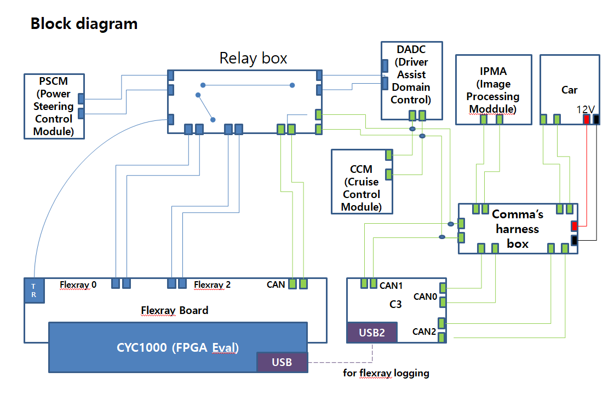

# Installation Guide of C3, openpilot for LAND ROVER DEFENDER

## 📌 Limitation
- Support only Lateral Control.
- Since lateral control is currently performed using the LKAS command, steering does not work below 50 km.
- Only tested on the 2023 Land Rover Defender 130.

## 📌 Requirements
- [comma3 or comma3x](https://comma.ai)
- [Flexray Board for processing Flexray data](#-📌-Flexray-Board-for-processing-Flexray-data),  [Reference Willem Melching's Blog](https://icanhack.nl/blog/audi-flexray/)
- [Y cable harness for IPMA(Image Processing Module)](#-y-cable-harness-for-ipmaimage-processing-module)
- [Y cable harness for DADC(Driver Assistance Domain Controller)](#-y-cable-harness-for-idadcdriver-assistance-domain-controller)
  
---

## 📌 C3 Block diagram

---

## 📌 Flexray Board for processing Flexray data

 - [CYC1000 FPGA Module](https://shop.trenz-electronic.de/en/TEI0003-03-QFCR4A-CYC1000-with-Intel-Cyclone-10-LP-10CL025-C8-8-MByte-SDRAM-8-MByte-Flash)

 - 
---

## 📌 Y cable harness for IPMA(Image Processing Module)

---
## 📌 Y cable harness for DADC(Driver Assistance Domain Controller)

---

---
