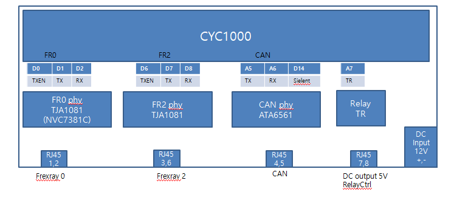
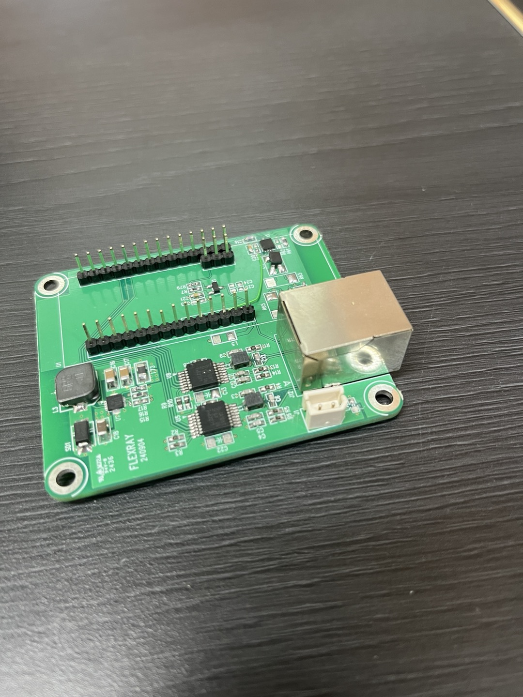
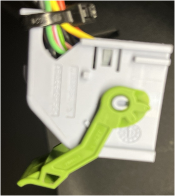
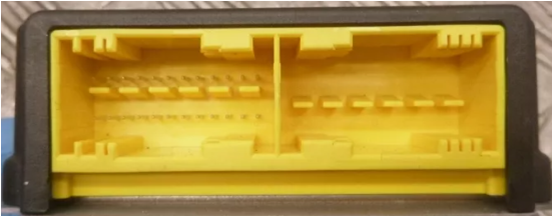

# Installation Guide of C3, openpilot for LAND ROVER DEFENDER

## 📌 Limitation
- Support only Lateral Control.
- Since lateral control is currently performed using the LKAS command, steering does not work below 50 km.
- Only tested on the 2023 Land Rover Defender 130.

## 📌 Requirements
- [comma 3 or comma 3x](https://comma.ai)
- [Flexray Board for processing Flexray data](#-📌-Flexray-Board-for-processing-Flexray-data),  [Reference Willem Melching's Blog](https://icanhack.nl/blog/audi-flexray/)
- [Y cable harness for IPMA(Image Processing Module)](#-y-cable-harness-for-ipmaimage-processing-module)
- [Y cable harness for DADC(Driver Assistance Domain Controller)](#-y-cable-harness-for-idadcdriver-assistance-domain-controller)
- Relay Box for Flexray (optional) 
---

## 📌 C3 Block diagram

---

## 📌 Flexray Board for processing Flexray data

 - [CYC1000 FPGA Module](https://shop.trenz-electronic.de/en/TEI0003-03-QFCR4A-CYC1000-with-Intel-Cyclone-10-LP-10CL025-C8-8-MByte-SDRAM-8-MByte-Flash)

   - For Flexray logging, you need to change the FT2232H Port B on the CYC1000 board to Fast Serial mode.
   - To enable the Fast Serial mode need to change Port B to use OPTO Isolate, attached is a screen shot of the change using FTDI programmer.

   - [Change internal FT2232H port B of CYC1000 ](https://www.hackster.io/MichalsTC/how-to-use-the-fast-serial-mode-on-a-ftdi-ft2232h-7f0682)

 - Flexray PHY board
  
  

---

## 📌 Y cable harness for IPMA(Image Processing Module)
- [MX34020SF1](https://www.digikey.kr/ko/products/detail/jae-electronics/-MX34020SF1/2139261)  20 pin female connector 
- [MX34020PF1](https://www.digikey.kr/ko/products/detail/jae-electronics/MX34020PF1/18996306?s=N4IgTCBcDaILIA0DMAWADGNAHAZiAugL5A) 20 pin male connector
- [Comma's Harness Box](https://comma.ai/shop/harness-box)

- MX34020xF1 20 pin map
  | num |  color      | desc                    |
  |-----|-------------|-------------------------|
  |  1  |  WH         | ETH High(broadR-Reach)  |
  |  2  |  GN         | ETH Low (BroadR-Reach)  |
  |  7  |  BU         | E-CAN High              |
  |  8  |  BU-GN      | E-CAN Low               |
  | 10  |  BU-BN      | +12V                    |
  | 17  |  BK         | Ground                  |

- connect MX34020xF1 and comma's Harness Box 
                   
  |    Harness Box|  MX34020PF1 (to car)  | MX34020SF1 (to cam) |  Flexray Board   |
  |------------------|--------------------------|------------------------|------------------|
  |     1 (CAR GND)  |           17             |                        |                  |
  |     2 (IGN)      |           10             |                        |                  |
  |     4 (CAN0 H)   |            7             |                        |                  |
  |     6 (CAN0 L)   |            8             |                        |                  |
  |     8 (CAN1 H)   |                          |                        |      CAN H       |
  |    10 (CAN1 L)   |                          |                        |      CAN L       |
  |    12 (12V IN)   |           10             |                        |                  |
  |    14 (12V IN)   |                          |         10             |                  |
  |    16 (IGN)      |                          |         10             |                  |
  |    18 (CAN1 H)   |                          |                        |      120 Ω       |
  |    20 (CAN1 L)   |                          |                        |   termination    |
  |    22 (CAN2 H)   |                          |          7             |                  |
  |    24 (CAN2 L)   |                          |          8             |                  |
  |    26 (GND   )   |                          |         17             |                  |
  |        -         |           1 -------------|--------- 1             |                  |
  |        -         |           2 -------------|--------- 2             |                  |
    

## 📌 Y cable harness for DADC(Driver Assistance Domain Controller)
- [284714-1](https://ko.aliexpress.com/item/1005004319496605.html?spm=a2g0o.order_list.order_list_main.5.1637140f944ZOH&gatewayAdapt=glo2kor) 24 pin female connector

  

- male connector  for 284714-1 24 pin female connecotr
  
  I don't know part number.

 

 
  It's on here [alibaba](<https://www.alibaba.com/product-detail/High-Precision-Small-Connector-Shell-IATF16949_1601044183554.html?spm=a2700.picsearch.normal_offer.d_image.48ba5f93RwfHtd>), but it's not for sale.
  
   So I bought a used ECU with a similar connector.
   I modified it and used it.

 - [Citroen C4 Picasso SRS Safety Restraint Control Module Unit 9664217980](https://www.ebay.com/itm/364957102520?_skw=9664217980&itmmeta=01JRFEWB2DCGSR8CWJN24EH1V5&hash=item54f92371b8:g:viYAAOSwLRpmcYx7&itmprp=enc%3AAQAKAAAA4FkggFvd1GGDu0w3yXCmi1dc33oIzpRxTV276AApSO2FcOpgTkn3XBLVV9q95MWhQjp8IWd8BfkSUS9Chbgz4%2BR3y174vvWaSzwLWRCZJqfkN%2B9c1484jR%2FCdm2fG4L8y%2B8jvW9RVZN5KxmexLKq5Vn9rNnBPa6Mjzr02mfCxJrngQ3ODWwPquKT3s6FcQkEVDDUr0K4WpYJwIBbl8Ql5YnY63zkXPp%2FOZGUN1%2BM4qxgT%2BYu%2BHXnccCqBSh2yiicXhJ08%2FQMRW8DIKICKP9TD98jEKIbcXQxcxtCXdWkm7kq%7Ctkp%3ABk9SR6qx8e7DZQ)

 - DADC 24 pin connector 284714-1 pin map

  | num |   desc                                       |
  |-----|----------------------------------------------|
  |  1  |  Bat+                                        |
  |  3  |  CAN2 H (Under BODY CAN, same IPMA CAN H)    |
  |  4  |  CAN2 L (Under BODY CAN, same IPMA CAN L)    |
  |  7  |  Flexray1_BP (to SWM, Steering Wheel Module) |
  |  8  |  Flexray1_BM (to SWM)                        |
  |  9  |  BAT GND                                     |
  | 11  |  BR1_P (to BCM, BroadR-Reach)                |
  | 12  |  BR1_M (to BCM, BroadR-Reach)                |    
  | 13  |  IGN                                         |
  | 15  |  CAN3 H (CCM, Cruise Control Module Radar)   |    
  | 16  |  CAN3 L (CCM, Cruise Control Module Radar)   |
  | 19  |  Flexray1_BP (to BCM)                        |   
  | 20  |  Flexray1_BM (to BCM)                        |
  | 21  |  Ground (GND)                                |   

 - connect Harness for DADC 

  |  male    (to BCM)        | 284714-1 female (to DADC) |  Flexray Board   |
  |--------------------------|------------------------------|------------------|
  |           1 -------------|--------- 1                   |                  |
  |           3 -------------|--------- 3                   |                  |
  |           4 -------------|--------- 4                   |                  |
  |           7 -------------|--------- 8                   |                  |
  |           8 -------------|--------- 8                   |                  | 
  |           9 -------------|--------- 9                   |                  |
  |          11 -------------|---------11                   |                  |
  |          12 -------------|---------12                   |                  |
  |          13 -------------|---------13 ------------------|----- 12V         |
  |          15 -------------|---------15                   |                  | 
  |          16 -------------|---------16                   |                  |
  |          19              |                              |      FR0+        |
  |          20              |                              |      FR0-        |              
  |                          |         19                   |      FR2+        |
  |                          |         20                   |      FR2-        |   
  |          21 -------------|---------21 ------------------|----- GND         |
  

---

